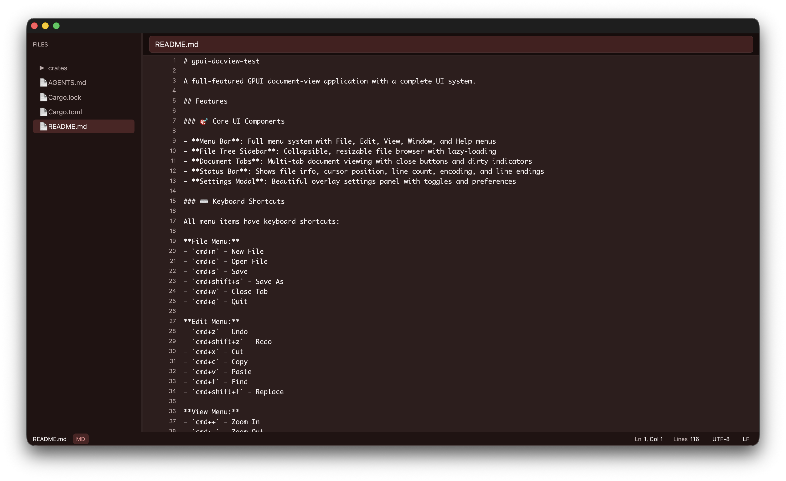

# Create GPUI Docview

Create a new GPUI document-view application in a single command.

[GPUI](https://www.gpui.rs/) is a fast, productive UI framework for Rust from the creators of [Zed](https://zed.dev/).

This generator scaffolds **document-view style applications** similar to Zed Editor, with proper Workspace, Pane, Dock, and Panel architecture patterns. For simple GPUI apps, use [create-gpui-app](https://github.com/zed-industries/create-gpui-app) instead.

## Quick Start

```sh
cargo install create-gpui-docview
create-gpui-docview --name my-app
cd my-app
cargo run -p my-app
```



## Creating an App

You'll need to have Rust and Cargo installed on your machine. You can install Rust through [rustup](https://rustup.rs/).

To create a new document-view app:

```sh
create-gpui-docview --name my-app
cd my-app
```

This will generate a complete workspace structure:

```
my-app
├── Cargo.toml (workspace root)
├── crates
│   ├── my-app              # Main application entry point
│   │   ├── Cargo.toml
│   │   └── src
│   │       └── main.rs
│   ├── pane                # Pane, PaneGroup, TabBar
│   │   ├── Cargo.toml
│   │   └── src
│   │       ├── pane.rs
│   │       ├── pane_group.rs
│   │       └── tab_bar.rs
│   ├── docking             # Dock system with Panel trait
│   │   ├── Cargo.toml
│   │   └── src
│   │       ├── dock.rs
│   │       └── panel_trait.rs
│   ├── panels              # Example panel implementations
│   │   ├── Cargo.toml
│   │   └── src
│   │       ├── file_tree_panel.rs
│   │       ├── settings_panel.rs
│   │       └── terminal_panel.rs
│   ├── modals              # Modal components
│   │   ├── Cargo.toml
│   │   └── src
│   │       ├── settings_modal.rs
│   │       ├── picker.rs
│   │       └── dialog.rs
│   ├── statusbar           # Status bar component
│   │   ├── Cargo.toml
│   │   └── src
│   │       └── lib.rs
│   └── theme               # Theme and settings management
│       ├── Cargo.toml
│       └── src
│           ├── theme.rs
│           └── settings_model.rs
└── README.md
```

Running `create-gpui-docview` with no `--name` argument creates an app called `gpui-docview-app`.

### Running the App

During development:
```sh
cargo run -p my-app
```

For production/performance testing:
```sh
cargo build --release
./target/release/my-app
```

## What's Included

A full-featured document-view workspace with:

- **Main app crate** - Application entry point with Workspace orchestration
- **Pane system** - Pane, PaneGroup, and TabBar for document/tab management
- **Docking system** - Dock component with Panel trait for sidebar/panel management
- **Panel examples** - FileTree, Settings, and Terminal panel implementations
- **Modal components** - Settings modal (⌘,), Picker, and Dialog modals for user interactions
- **Status bar** - Bottom status bar with file info and workspace indicators
- **Theme system** - Live theme switching with 4 built-in themes (Dark, Light, High Contrast, Moonlight)
- **Menu system** - Native macOS menu bar with keyboard shortcuts

All components follow GPUI best practices with Entity-based architecture and proper event handling.

### Key Features

- **Settings Modal** - Accessible via ⌘, (Cmd+Comma), provides a clean interface for app configuration and theme selection
- **Live Theme Switching** - Choose from 4 beautiful themes with instant preview: Dark (purple accents), Light (clean whites), High Contrast (accessibility), and Moonlight (cyan accents). Switch themes on-the-fly from the Settings modal.
- **Native Menus** - Fully integrated macOS menu bar with File, Edit, View menus and keyboard shortcuts
- **Keyboard-driven** - Comprehensive keyboard shortcuts following macOS conventions
- **Reactive Architecture** - Built with GPUI's Entity system for responsive theme updates across all components

### Troubleshooting

See the Zed development troubleshooting guide for platform-specific hints:
https://github.com/zed-industries/zed/blob/main/docs/src/development/macos.md#troubleshooting

## Contributing

Your contributions are welcome! Please read `CONTRIBUTING.md` for more details.

## License

`create-gpui-docview` is open source software [licensed as MIT](LICENSE).
